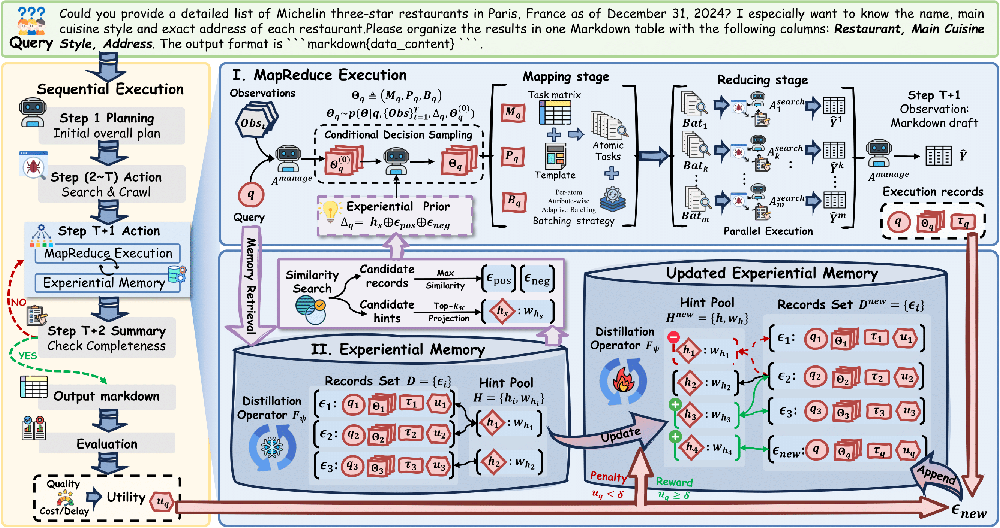

<div align="center">

<h2>A-MapReduce: Executing Wide Search via Agentic MapReduce</h2>

</div>

<div align="center">

  <a href='https://www.python.org/downloads/release/python-31010/'></a>
  
</div>

This is the official repository for **A-MapReduce**, a MapReduce-style multi agent framework that achieves SOTA results on wide search datasets. This codebase is adapted from **[Flash-Searcher](https://github.com/OPPO-PersonalAI/Flash-Searcher)** — DAG-based parallel execution framework for agent task execution and trajectory collection. 

<div align="center">
    
</div>

## Quick Start ⚙
#### 1. Env Setup
```bash
conda create -n a_mapreduce python=3.10
conda activate a_mapreduce
pip install -r requirements.txt
pip install langchain_chroma==1.0.0 langchain-core==1.0.4 gradio==5.22.0 aiofiles==23.2.1
```

#### 2. Set up environment variables

A-MapReduce framework and model use `SearchTool` and `CrawlTool` for web search and crawl pages, which require environment variables with the corresponding API key, based on the selected provider:
- `SERPER_API_KEY` for SerpApi: [Serper]
(https://serper.dev/)
- `JINA_API_KEY` for JinaApi: [JinaAI]
(https://jina.ai/)

Depending on the model you want to use, you may need to set environment variables. You need to set the `DEFAULT_MODEL`, `OPENAI_BASE_URL` and `OPENAI_API_KEY` environment variable.

#### 3. Run A-Mapreduce Framework
Step 1: Cold start (no plan mode)

Widesearch:
```bash
python run_widesearch.py --enable_expmemory --expmemory_namespace widesearch --selected_tasks <task_index_1> <task_index_2> ... --trial_num 4
```
DeepWideSearch:
```bash
python run_deepwidesearch.py --enable_expmemory --expmemory_namespace deepwidesearch --selected_tasks <task_index_1> <task_index_2> ... --trial_num 14
```
Note: Cold start is complete once the memory store has accumulated enough retrievable tasks and `insights.json` contains usable hints (you should see multiple non-empty entries). You can control the hint generation pace by tuning `--expmemory_start_insights_threshold` and `--expmemory_rounds_per_insights`. `--selected_tasks` uses dataset indices (0-based) from the input JSON/JSONL file; for example, `--selected_tasks 0 3 5`.

Step 2: Normal self-evolution (plan mode)

Widesearch:
```bash
python run_widesearch.py --enable_expmemory --expmemory_namespace widesearch --selected_tasks <task_index_1> <task_index_2> ... --trial_num 4 --mapreduce_plan_mode
```
DeepWideSearch:
```bash
python run_deepwidesearch.py --enable_expmemory --expmemory_namespace deepwidesearch --selected_tasks <task_index_1> <task_index_2> ... --trial_num 4 --mapreduce_plan_mode
```

#### 4. Quick demo of self-evolution (using pre-warmed memory)
Widesearch example:
```bash
python run_widesearch.py --enable_expmemory --expmemory_namespace "widesearch_test" --mapreduce_plan_mode --selected_tasks 12 --trial_num 4
```
DeepWideSearch example :
```bash
python run_deepwidesearch.py --enable_expmemory --expmemory_namespace "deepwidesearch_test" --mapreduce_plan_mode --selected_tasks 41 --trial_num 4
```

### Key Parameters

| Parameter | Description | Example |
|-----------|-------------|---------|
| `--max_steps` | Maximum agent steps | `40` |
| `--mapreduce_max_steps` | Max steps for sub-agents spawned by mapreducetool | `40` |
| `--mapreduce_plan_mode` | Enable plan+execute two-phase mode | `store_true`  |
| `--mapreduce_insight_topk` | Number of memory hints to include in mapreduce plan stage | `3` |
| `--selected_tasks` | Optional list of dataset indices to run | `0 1 2` |
| `--trial_num` | Number of trials per task | `4` |
| `--enable_expmemory` | Enable record logging | `store_true` |
| `--expmemory_start_insights_threshold` | Minimum memory size before insights updates start | `40` |
| `--expmemory_rounds_per_insights` | Update insights every N new records | `20` |
| `--expmemory_merge_insights_interval` | Merge insights every N records once threshold is reached | `40` |

## Acknowledgments

This work builds upon and adapts code from:

- **[Flash-Searcher](https://github.com/OPPO-PersonalAI/Flash-Searcher)** — DAG-based parallel execution framework for agent task execution and trajectory collection

We sincerely thank the contributors of these projects for their excellent work in advancing agent-based systems.
